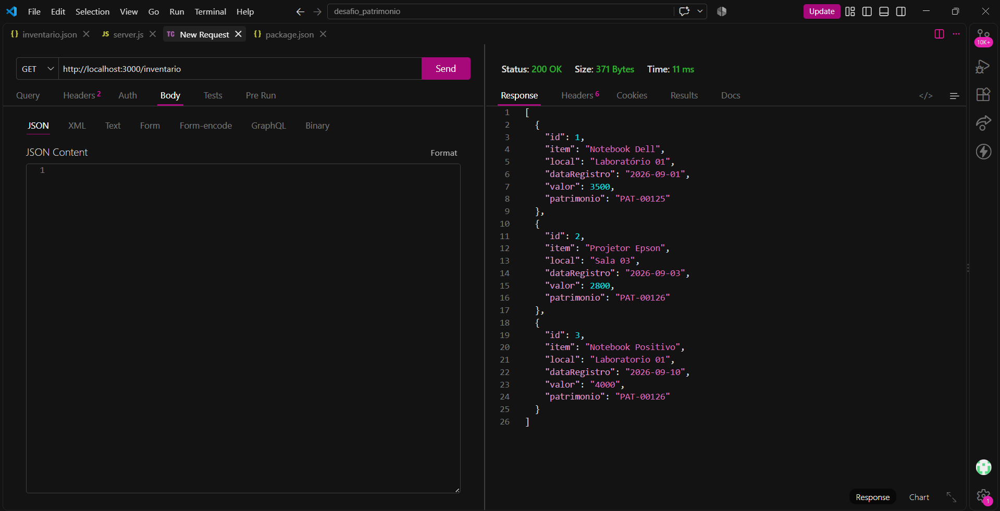
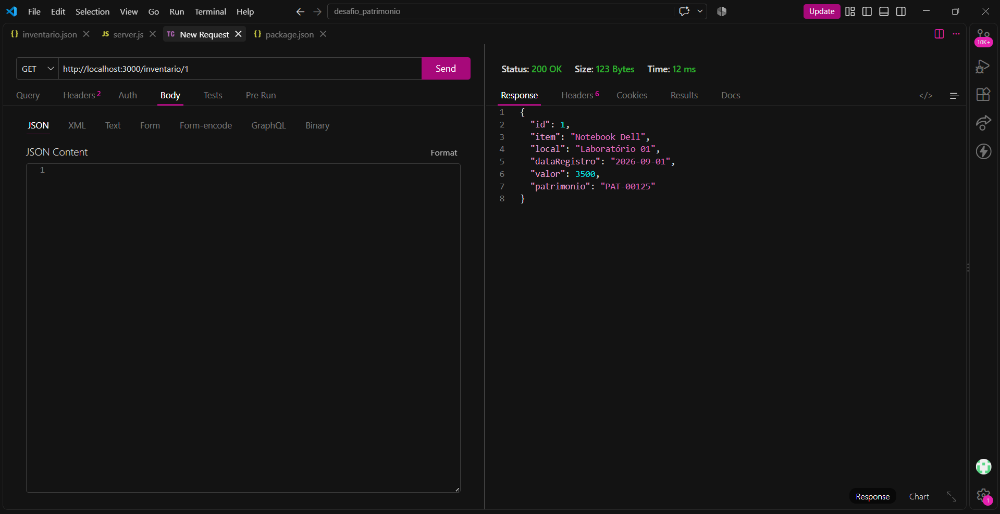
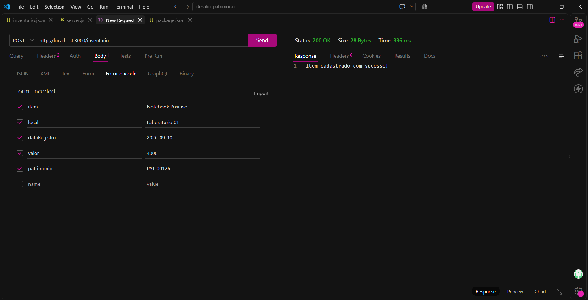
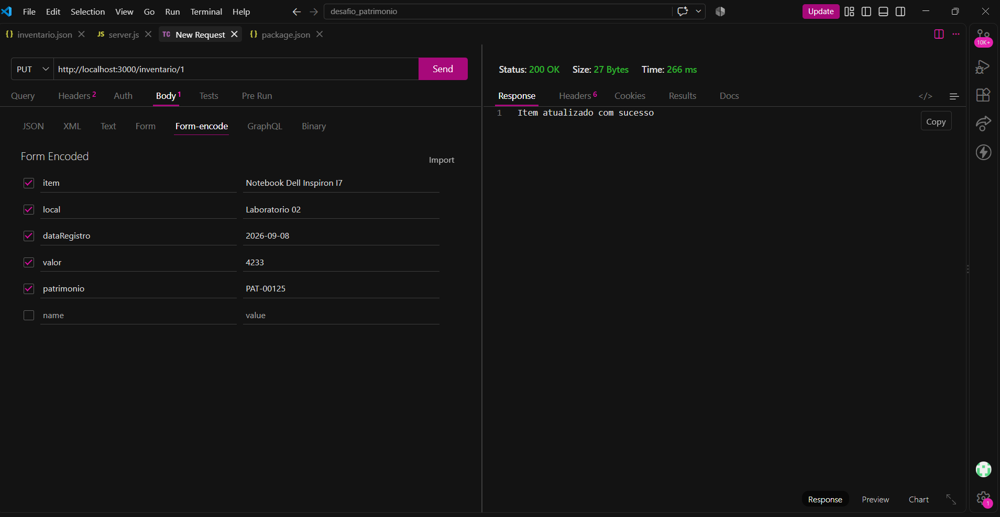
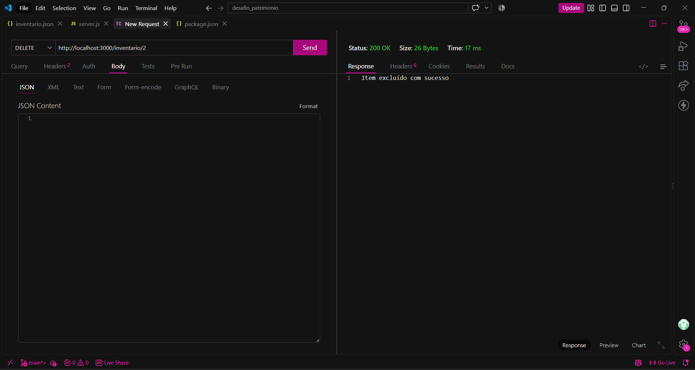

# Atividade Aula 05

Atividade de Programação Back-End (PBE).

## Sobre o projeto

Este projeto é uma API para gerenciamento de um inventário de patrimônios.

Através dela é possível consultar, adicionar, alterar e excluir itens.

## Tecnologias utilizadas

* Node.js
* Express
* JSON
* VSCode
* Thunder Client

## Como executar

1. Abra a pasta do projeto no VSCode.

2. No terminal, instale as dependências:

```bash
npm install
```

3. Inicie o servidor:

```bash
node server.js
```

4. A API ficará disponível em:

```text
http://localhost:3000/inventario
```

## Rotas disponíveis

| Método | Rota              | Descrição                    |
| ------ | ----------------- | ---------------------------- |
| GET    | `/inventario`     | Lista os itens do inventário |
| GET    | `/inventario/:id` | Busca um item pelo ID        |
| POST   | `/inventario`     | Adiciona um novo item        |
| PUT    | `/inventario/:id` | Atualiza um item             |
| DELETE | `/inventario/:id` | Exclui um item               |

## Testes das rotas

Os testes foram realizados utilizando o **Thunder Client**.

### 1. Listar itens

**GET**

```text
http://localhost:3000/inventario
```



Resposta:

```json
[
  {
    "id": 1,
    "item": "Notebook Dell",
    "local": "Laboratório 01",
    "dataRegistro": "2026-09-01",
    "valor": 3500,
    "patrimonio": "PAT-00125"
  },
  {
    "id": 2,
    "item": "Projetor Epson",
    "local": "Sala 03",
    "dataRegistro": "2026-09-03",
    "valor": 2800,
    "patrimonio": "PAT-00126"
  }
]
```

### 2. Buscar item pelo ID

**GET**

```text
http://localhost:3000/inventario/1
```



Resposta:

```json
{
  "id": 1,
  "item": "Notebook Dell",
  "local": "Laboratório 01",
  "dataRegistro": "2026-09-01",
  "valor": 3500,
  "patrimonio": "PAT-00125"
}
```

### 3. Adicionar item

**POST**

```text
http://localhost:3000/inventario
```




Resposta:

```text
Item cadastrado com sucesso!
```

### 4. Atualizar item

**PUT**

```text
http://localhost:3000/inventario/1
```




Resposta:

```text
Item atualizado com sucesso
```

### 5. Excluir item

**DELETE**

```text
http://localhost:3000/inventario/2
```



Resposta:

```text
Item excluído com sucesso
```
